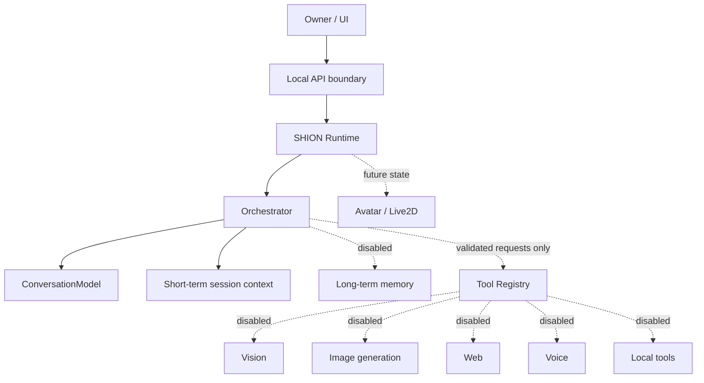

# SHION Future Architecture

Status: Phase 1 foundation (2026-08-09)

## Design boundary

SHION is an application-level personal companion. A conversation LLM is one
replaceable reasoning component; it is not the complete SHION system.



The solid path is implemented. Dotted capabilities are interfaces or explicit
disabled entries only. They do not load models, access the network, or execute
tools.

## Phase 1 repository responsibilities

```text
app/
  server.py                 localhost HTTP and static-file boundary
  core/
    shion_runtime.py        lifecycle and application coordination
    orchestrator.py         conversation-first orchestration seam
    session.py              volatile short-term chat history
    state.py                runtime state vocabulary
  models/
    conversation_model.py   common ConversationModel protocol
    registry.py             server-side allowlist and public projection
    loader.py               offline model-adapter construction
  runtime/
    model_runtime.py        compatibility adapter for current Transformers runtime
  memory/
    interface.py            long-term memory contract
    long_term.py            disabled implementation
  tools/
    interface.py            capability result and tool contract
    registry.py             default-deny registry and disabled capabilities
  static/
    assets/shion/            replaceable avatar assets
    index.html, styles.css, app.js
```

`app.runtime.model_runtime.LocalModelRuntime` remains in place as a compatibility
adapter. Moving its tokenizer/model-specific implementation is deferred until a
separate migration can preserve the already-validated Gemma, Mistral, Qwen, NF4,
EOS and non-thinking behavior.

## Request flow

1. `server.py` accepts only a localhost request with a bounded JSON body.
2. `ShionRuntime` obtains the in-memory short-term history.
3. `ShionOrchestrator` selects the conversation-only path in Phase 1.
4. The allowlisted `ConversationModel` produces a response.
5. The current turn is retained in volatile session memory.

Future tool routing must create a structured request and pass it through the tool
registry and capability-specific security validation. Conversation-model output
must never be forwarded directly to `eval`, `exec`, a shell, PowerShell, a browser,
the filesystem, or the network.

## Model abstraction

UI and session code depend on an alias and the `ConversationModel` protocol, not a
Transformers class. The registry/loader/runtime adapter owns model class selection,
tokenizer loading, chat-template options, thinking mode, EOS IDs, quantization and
generation defaults. Client-provided model paths remain prohibited.

## Memory

- Short-term memory is the current `(session, mode)` conversation context and is
  cleared on New Chat or model switch.
- Long-term memory is a separate future service for preferences, relationship
  history, events and SHION memories. It is currently unavailable and performs no
  persistence or retrieval.

Chat history must not become long-term memory merely because a storage backend is
added later. Retention, consent, deletion and retrieval policies belong at the
long-term-memory boundary.

## Tool and security architecture

Vision, image generation, web, voice and local tools are registered as disabled.
Unknown or disabled invocations return `ToolResult(available=False)` without
calling an implementation. Enabling a future tool requires all of:

1. explicit Owner configuration;
2. a typed request schema;
3. capability-specific allowlists and validation;
4. bounded resource and timeout policy;
5. safe result serialization back to the orchestrator;
6. tests proving no direct model-to-capability path.

External network access remains absent. The server continues to bind exclusively
to `127.0.0.1`.

## UI and message evolution

The Phase 1 UI keeps the established dark-purple vertical chat and adds SHION
identity, an avatar asset boundary, copy controls, a collapsible Model Info panel,
an Experimental badge, a reserved desktop conversation rail, and safe generation
stopping. The generating label is presentation state, not internal reasoning or
chain-of-thought.

The frontend normalizes current text into content parts:

```json
[{"type": "text", "text": "..."}]
```

This creates a future rendering seam for `image`, `file`, and `tool_result` parts
without changing the current API response. Composer slots are reserved for later
attachment and microphone controls. No upload or voice behavior exists now.

Avatar assets live under `app/static/assets/shion/`. The current SVG can be replaced
by a portrait while keeping the message/header component. A later Avatar adapter
can map SHION state to portrait expressions or Live2D motions; it must not be
coupled to the conversation model class.

## Stop generation

The browser changes Send to Stop while a request is generating. `/api/stop` sets a
session-scoped cancellation event. A Transformers stopping criterion observes it
between token steps, returns the partial text, and leaves the model loaded so the
next turn can continue. Stop does not kill a process or unload model weights.

## Future capability roadmap

- Vision: validated image upload -> vision adapter -> structured observation ->
  orchestrator -> conversation response.
- Image generation: structured prompt request -> isolated generator -> safe local
  artifact reference -> multipart message rendering.
- Voice: microphone input and speech output adapters outside conversation-model
  logic, both explicitly enabled by the Owner.
- Web: restricted fetch/search tool with domain, network, timeout and content
  validation; never direct LLM network access.
- Smartphone: keep UI responsive and separate network exposure from UI/runtime.
- Live2D: presentation adapter consumes explicit SHION expression/state events and
  never receives unrestricted tool authority.

Network stages are intentionally separate:

1. Current: localhost (`127.0.0.1`) only.
2. Future Owner-reviewed stage: authenticated LAN binding.
3. Future Owner-reviewed stage: authenticated Tailscale access.

No Stage 2 or Stage 3 networking is implemented by this change.

## Migration phases

- Phase 1 (this change): extract core/session/registry/orchestrator/tool/memory
  boundaries, retain runtime compatibility, polish UI.
- Phase 2: move model-family details behind explicit adapters and split HTTP route
  handlers into API modules, with parity tests for every approved model.
- Phase 3: add only Owner-approved capability implementations, persistence and
  presentation adapters one boundary at a time.
