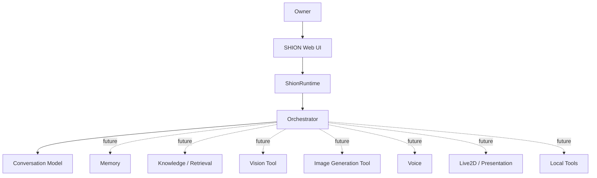

# Project SHION Future Roadmap

Status: Owner-approved architecture memo

Recorded: 2026-08-10

This document owns **what Project SHION plans to build, in what order, and with
which approval gates**. The implementation boundaries and security model are
owned by [SHION Future Architecture](../architecture/shion_future_architecture.md).
Accepted cross-project policy is recorded in
[Design Decisions](../development/design_decisions.md).

This roadmap is directional, not authorization to download a model, expose a
network service, persist private conversation data, train, or enable a tool.
Each implementation phase still requires scoped Owner review.

## Product direction

Project SHION will develop from a local conversation application into a
**Personal AI Companion**. SHION is not a single universal model. The existing
`ShionRuntime`, `ShionOrchestrator`, `ConversationModel`, memory boundary, and
tool boundary will coordinate independently replaceable subsystems.



The Conversation Model remains the center of SHION's conversation, reasoning,
and personality. Vision, image generation, memory, crawling, voice, presentation,
and privileged local actions remain independent tools or services. Replacing a
Conversation Model must not require rebuilding the other subsystems.

## Workstreams

### 1. Conversation and SHION personality

The current priority is conversation quality, with the Gemma 4 family as the
working conversation foundation. The development flow remains:

```text
Canonical SHION
  -> Owner-reviewed Dataset
  -> LoRA / fine-tuning
  -> fixed Evaluation
  -> Owner manual evaluation
```

Quality targets include natural Japanese conversation, human-like casual talk,
light humor and teasing, character consistency, context understanding, and help
only when it is appropriate or requested. Evaluation must detect generic assistant
closings, unnecessary AI self-introduction, gratuitous lists or advice, unnatural
length, and repeated closing patterns.

Conversation-model exploration is considered complete for the current development
cycle. This is a direction for continued Gemma 4 evaluation and SHION training,
not an irreversible ban on future model review.

### 2. Memory and knowledge

Memory is not equivalent to chat history. Planned responsibilities are:

- **Short-term memory:** the current conversation context.
- **Long-term memory:** reviewed past events and continuing user information.
- **Character memory:** SHION's experience and continuity.
- **Knowledge:** external or crawler-derived information with provenance.

Long-term memory should follow an explicit pipeline:

```text
Conversation
  -> Memory extraction
  -> review / filtering
  -> storage
  -> retrieval
  -> Orchestrator context
```

The system must not persist every conversation by default. Retention, review,
deletion, privacy, and retrieval policies are prerequisites to implementation.

### 3. Crawler and local knowledge

A separately developed crawler may later feed a local knowledge store:

```text
Internet -> Crawler -> Local Knowledge Store -> Retrieval
         -> SHION Orchestrator -> Conversation Model
```

Crawler access is not direct Conversation Model access. Knowledge retrieval stays
separate from training knowledge into model weights, and must preserve source and
freshness metadata. No crawler integration is implemented by this roadmap.

### 4. Image generation

Owners should be able to request images in natural Japanese. They should not need
to author Stable Diffusion prompts.

```text
Natural request
  -> Image-generation intent
  -> SHION visual specification
  -> Prompt Builder
  -> ImageGenerationTool
  -> backend adapter
  -> local image artifact
  -> conversation timeline
```

The existing Stable Diffusion installation will be audited before integration to
identify whether it uses AUTOMATIC1111, Forge, ComfyUI, Diffusers, or another
runtime. Integration must use a `StableDiffusionAdapter` behind the tool interface,
not a direct dependency from `ShionRuntime`.

Image output belongs in the normal conversation timeline. Follow-up messages such
as “もう少し笑って”, “その服のまま座って”, or “背景だけ夜にして” should
eventually become structured image-edit intents referencing the prior artifact.

### 5. Image-model and visual-quality policy

An image model requires all of:

1. distribution, license, and security review;
2. runtime validation;
3. a short bounded generation test;
4. Owner visual review.

Benchmarks and model cards do not override Owner visual review. Results must record
security/runtime quality separately from suitability.

#### Animagine XL 4.0 Opt decision

- Security / Runtime: **PASS**
- Owner Visual Quality: **REJECT**
- SHION official image model: **NOT ADOPTED**

Animagine XL 4.0 Opt remains historical evidence that runtime success does not
equal SHION suitability. It must not be presented as the selected SHION image
foundation without a new explicit Owner decision.

### 6. SHION visual identity and Character LoRA

After an image base model passes Owner review, evaluate a SHION Character LoRA for
face, hair, body shape, character colors, and visual identity consistency. Later
experiments may combine reference images, IP-Adapter, ControlNet, OpenPose,
img2img, and inpainting for controlled clothes, pose, expression, and background
changes. Each component receives its own security, runtime, and Owner quality gate.

### 7. Vision

Vision is the inverse visual flow and remains separate from image generation:

```text
Owner image -> Vision Model -> Structured Observation
            -> Orchestrator -> Conversation Model -> SHION response
```

The Conversation Model must not directly own arbitrary image processing. Upload,
format validation, artifact lifetime, and privacy rules must be defined before the
Vision Tool is enabled.

### 8. Core chat experience

The current SHION Web Chat identity remains the design base. Candidate additions:

- persistent sessions, conversation history, and search;
- edit, regenerate, branching, and deletion controls;
- Markdown, plain-text, and JSONL export;
- attachments, image parts, and tool-result parts;
- vision, image generation, voice, model information, and session information.

Export schema planning should allow timestamps, session ID, model ID and revision,
conversation mode, roles, typed content, generation metadata, and local image
artifact references. Export is always an explicit Owner action.

### 9. Dataset-candidate export

Dataset export is separate from ordinary conversation export:

```text
Free conversation
  -> Export as Dataset Candidate
  -> Owner review
  -> Golden Candidate
  -> approved Dataset workflow
```

Conversation must never be added automatically to the Golden Dataset. Conversation
logs and candidates must not be automatically committed or pushed to GitHub.

### 10. Voice

Voice is a separate subsystem:

```text
Speech-to-Text -> SHION orchestration -> Text-to-Speech
```

A future SHION-specific voice model may be evaluated independently. Microphone
permission, local audio retention, model license, and Owner voice-quality review
are prerequisites.

### 11. Live2D and presentation

Conversation output may produce a bounded presentation state:

```yaml
emotion: teasing
expression: smile
intensity: 0.4
```

A Presentation Controller validates and maps that state to Live2D expressions and
motions. The Conversation Model must not directly control a Live2D API.

### 12. GPU deployment

The current target is an RTX 5070 with 12 GB VRAM. Conversation and image models
do not need to remain resident simultaneously. On one GPU, lifecycle experiments
may unload conversation, run image generation, then reload conversation while
preserving safe application state.

For a future multi-GPU system, prefer explicit roles—Conversation on GPU 1 and
image generation or vision on GPU 2. Do not assume separate GPU VRAM can be added
into one transparent pool.

## Security and privacy principles

- localhost remains the default network boundary;
- arbitrary model paths, filesystem access, shell, and network access are denied;
- tools remain default-deny and require explicit Owner enablement;
- model custom code requires strict review; `trust_remote_code=False` and
  Safetensors are preferred;
- secrets, private generated data, and conversation logs are not committed;
- conversation data is never transmitted externally without explicit authority;
- model or tool output is never executed directly;
- each new subsystem must define validation, resource bounds, stop behavior, and
  artifact retention before activation.

## Phased development order

### Phase 1 — Conversation Quality

- continue Gemma 4 comparison and select the approved training foundation;
- train and evaluate SHION LoRA using Owner-approved data;
- improve Japanese naturalness, personality continuity, and assistant-bias gates;
- keep fixed evaluation and Owner manual review as separate gates.

Exit criterion: the Owner accepts a conversation model/configuration as the next
SHION development baseline. Training authorization remains separate.

### Phase 2 — Core Chat UX

- persistent conversation and session design;
- explicit export;
- regenerate, edit, branch, deletion, and search semantics;
- retention/privacy review and migration tests.

Exit criterion: sessions can be managed and exported without accidental
persistence, cross-session leakage, or automatic dataset/Git writes.

### Phase 3 — Image Generation

- audit the existing Stable Diffusion environment;
- define `ImageGenerationTool`, adapters, artifacts, stop/recovery, and resource
  ownership;
- evaluate image base models through security/runtime/Owner visual gates;
- render image messages in the normal chat timeline.

Exit criterion: one Owner-approved local image backend can generate and return a
bounded artifact through the tool boundary.

### Phase 4 — SHION Visual Identity

- evaluate Character LoRA and identity-consistency data;
- add reference-image, IP-Adapter, ControlNet, pose, edit, and inpainting flows;
- add Vision Tool input and structured observations.

Exit criterion: Owner accepts SHION identity consistency across a defined visual
evaluation set and manual review.

### Phase 5 — Memory and Knowledge

- design reviewed long-term memory extraction and deletion;
- connect a provenance-aware local knowledge store and retrieval layer;
- evaluate crawler integration as a separately secured data pipeline.

Exit criterion: memory and knowledge can be retrieved intentionally without
confusing chat history, fabricated memory, or unreviewed persistent data.

### Phase 6 — Multimodal Companion

- integrate bounded speech-to-text and text-to-speech;
- evaluate a SHION voice model;
- implement Presentation Controller and Live2D state mapping;
- coordinate multimodal lifecycle and future multi-GPU placement.

Exit criterion: voice and presentation can be disabled independently and cannot
grant the Conversation Model direct device or tool control.

## Decision and review rules

- Owner qualitative review can reject a model that passes security and runtime.
- Security/runtime PASS and quality PASS are always reported separately.
- Dataset candidates require Owner review before Golden promotion.
- Private conversations are not training data merely because they were produced
  in the SHION UI.
- Roadmap status changes, model adoption, network exposure, and persistent-data
  activation require explicit documented decisions.

## Out of scope for this documentation change

This memo does not implement memory, crawler access, image generation, vision,
voice, Live2D, persistent history, network exposure, or training. It does not
modify runtime configuration, model weights, datasets, evaluation, or the Web UI.
